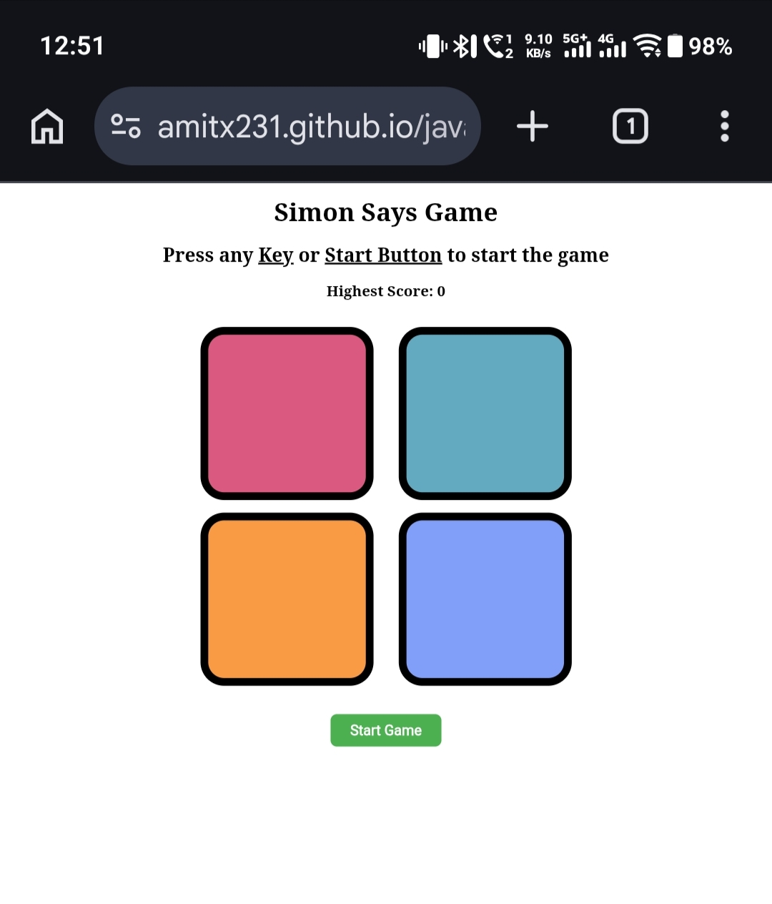
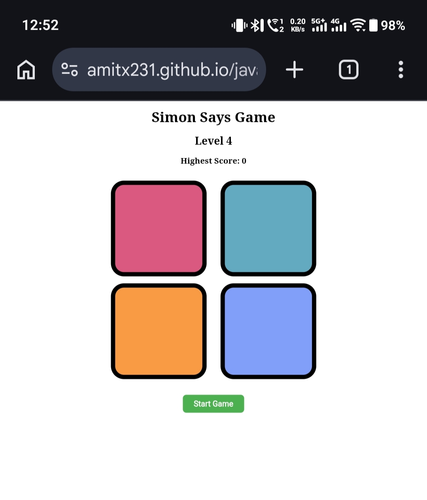
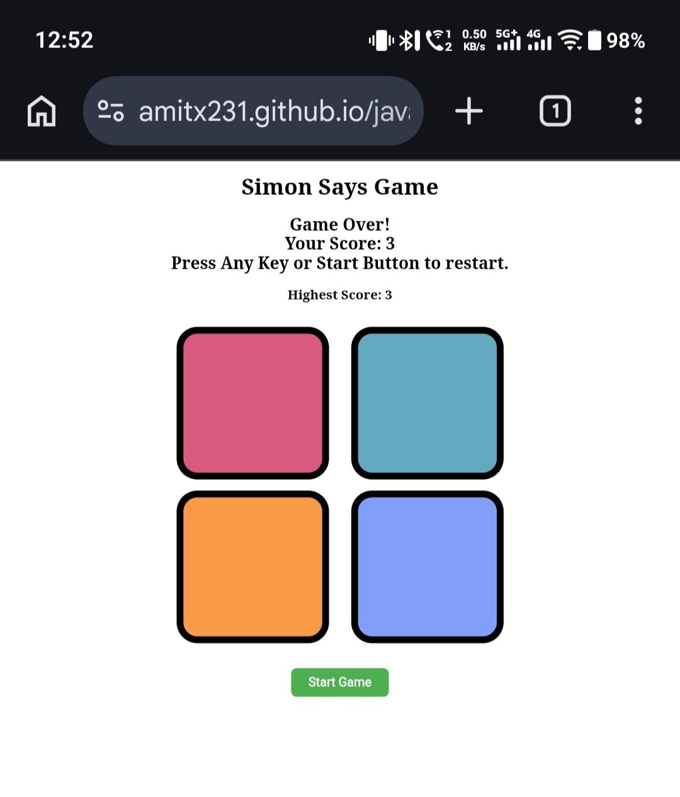

# 🎮 Simon Says Game

A browser-based implementation of the classic **Simon Says** memory game built using **HTML5**, **CSS3**, and **Vanilla JavaScript**.

The game challenges players to remember and repeat an increasingly long sequence of colors. Each correct round increases the difficulty by adding a new color to the sequence.

---

## ✨ Features

- 🎲 Random color sequence generation
- 🎯 Level progression
- 🧠 Memory-based gameplay
- ⚡ Interactive button animations
- 🎨 Visual feedback for user and game actions
- 🏆 High score tracking (Current Session)
- ❌ Game Over screen with restart option
- 🔄 Restart game after Game Over
- 📱 Mobile Touch Support
- 💾 Save High Score using Local Storage
- 📱 Responsive design for desktop and mobile devices

---

## 🛠️ Technologies Used

- HTML5
- CSS3
- JavaScript (ES6)

---

## 📚 Concepts Practiced

- DOM Manipulation
- Event Handling
- Arrays
- Functions
- Conditional Statements
- Random Number Generation
- Timers (`setTimeout`)
- CSS Class Manipulation
- Game State Management

---

## 📁 Project Structure

```text
javascript-simon-game/
│
├── index.html
├── style.css
├── app.js
├── README.md
├── .nojekyll
├── favicon.svg
└── screenshots/
    ├── gameStart.jpeg
    ├── gamePlay.jpeg
    └── gameOver.jpeg
```

---

## 🚀 How to Play

1. Open `index.html` in your browser.
2. Press any key to start the game.
3. Watch the flashing color sequence.
4. Repeat the sequence by clicking the colored buttons.
5. Successfully repeat the sequence to advance to the next level.
6. If you make a mistake, the game ends and displays your score.

---

## 📸 Preview

### Game Start



### Gameplay



### Game Over



---

## 🎯 Learning Outcomes

While building this project, I practiced:

- JavaScript Event Handling
- DOM Manipulation
- Managing Game State
- Random Sequence Generation
- Working with Arrays
- Animating Elements using CSS Classes
- Timers with `setTimeout`
- Implementing Game Logic

---

## 🔮 Future Improvements

- 🎵 Add Sound Effects
- 🌙 Dark Mode
- 🎮 Difficulty Levels
- ⏸ Pause and Resume Game
- 🎨 Better Animations
- 🏅 Leaderboard

---

## 👨‍💻 Author

**Amit Chauhan**

If you found this project helpful, feel free to ⭐ the repository.